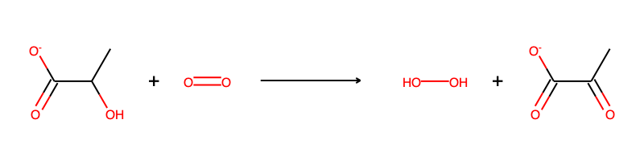
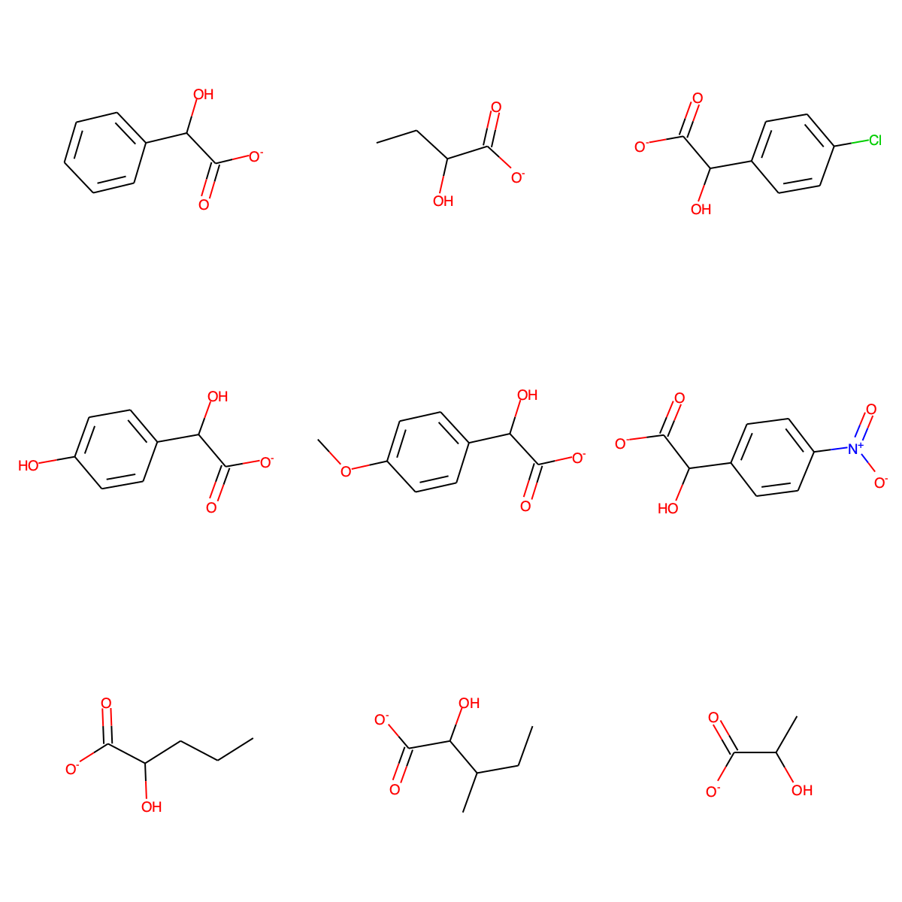

Getting Started
===============

This page details how to get started with ehreact. 

Requirements
------------
Ehreact uses Python 3.6+ and a number of python packages, see :ref:`Installation <installation>` for a detailed installation instruction and list of dependencies. We assume you have Conda on your system. If this is not the case yet, install Miniconda from `<https://conda.io/miniconda.html>`_.

.. _installation:

Installation
------------
To install ehreact, make a new conda environment via::

  conda env create -f environment.yml
  conda activate ehreact
  pip install -e .

(Note: If you have an old version of conda (< conda 4.4), the second command is :code:`source activate ehreact`.)

To check your installation, try to import ehreact in a Python session::

  import ehreact

Tutorial
--------
After installing ehreact, you are ready to calculate, plot and score a few Hasse diagrams. We will use the enzyme class L-lactate oxidase (EC. 1.1.3.2) as an example, with reactions taken from `BRENDA <https://www.brenda-enzymes.org/enzyme.php?ecno=1.1.3.2#SUBSTRATE>`_ after removing stereochemistry. Exemplary data files can be found in :code:`ehreact/data/`.

Lactate oxidase can oxidize lactate using oxygen:

	   
We will use nine known substrates for L-lactate oxidase to construct extended Hasse diagrams, and later also score some new putative reactions::
  
  C1=CC=C(C=C1)C(C(=O)[O-])O
  CCC(C(=O)[O-])O
  OC(C([O-])=O)c1ccc(Cl)cc1
  C1=CC(=CC=C1C(C(=O)[O-])O)O
  COc1ccc(cc1)C(O)C([O-])=O
  OC(C([O-])=O)c1ccc(cc1)[N+]([O-])=O
  CCCC(C(=O)[O-])O
  CCC(C)C(C(=O)[O-])O
  CC(C(=O)[O-])O

	   
First, let's use ehreact from the command line::

  python train.py --data_path ehreact/data/molecule_training.smi --save_path test.pkl --plot --train_mode single_reactant --seed "C([H])O[H]" --no_props --no_qm 
